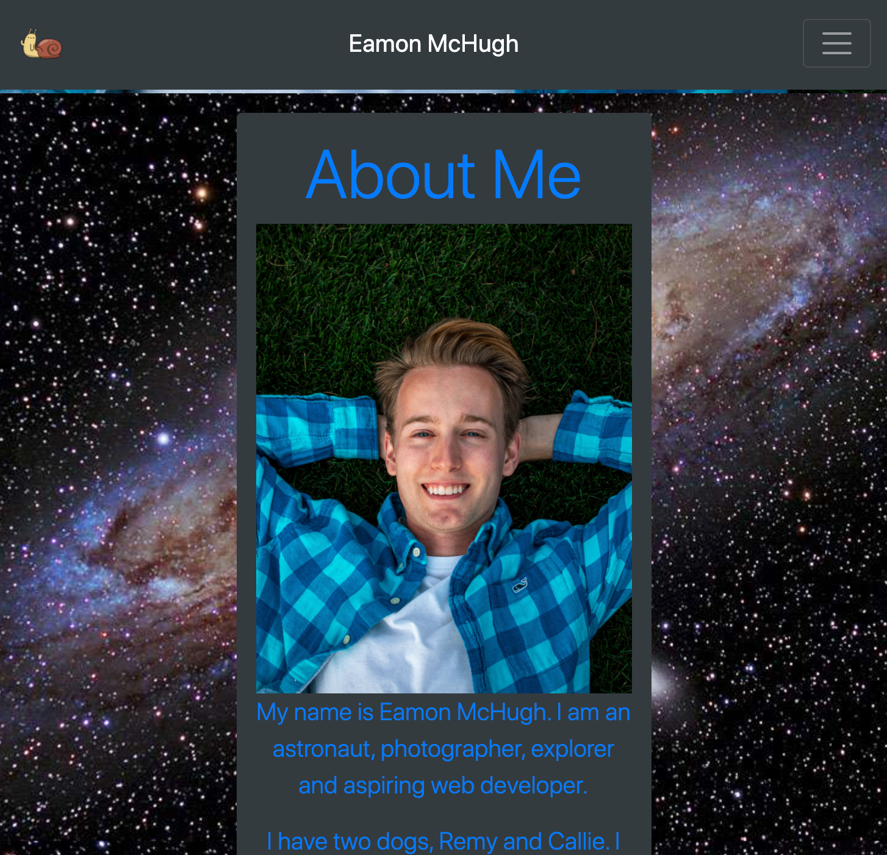
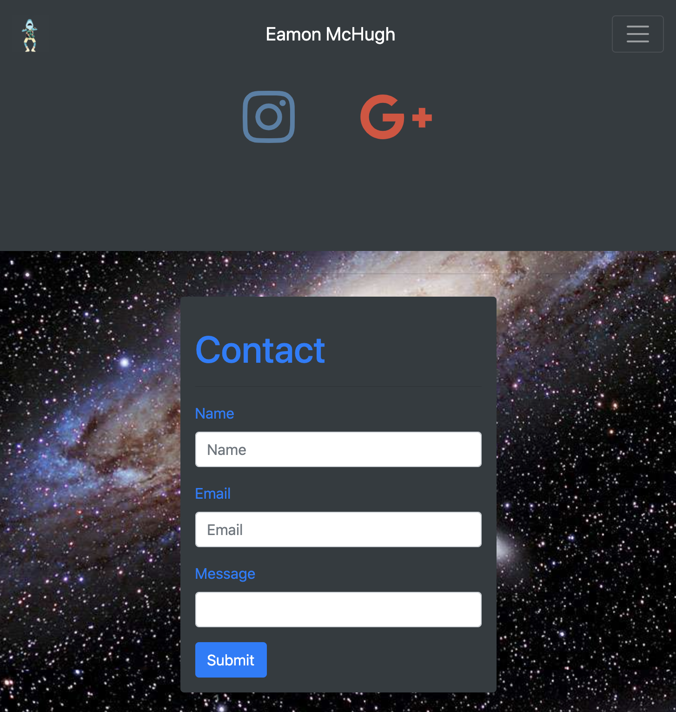

# Responsive Portfolio
## Use the Bootstrap CSS Framework, I created a responsive portfolio.

## Links
[Link to live site](https://eamon02.github.io/Bootstrap-Repositoy/)

## Photos






### Directions
 * 3 pages (```index.html```, ```contact.html```, and ```portfolio.html```)
 * Using Bootstrap, develop your portfolio site with the following items:
   - A navbar
   - A responsive layout
   - Responsive images
 * The Bootstrap portfolio should minimize the use of media queries.
 * Screenshots are provided as a reference in the `Assets/Images` folder. Your app does not need to be _exactly_ like the images. Use Bootstrap to create a similar, responsive layout.

### Hints

* Use Bootstrap's grid system (containers, rows, and columns).

* On an `xs` screen, content should take up the entire screen. On `sm` and larger screens, you should have some margins on the left and right sides of the screen. Check out various sites on your mobile device vs. your computer to see examples of these differences.

* Use an HTML validation service to ensure that each page has valid HTML.


### Minimum Requirements

* Functional, deployed application

* GitHub repository with README describing the project

* Navbar must be consistent on each page.

* Navbar on each page must contain links to Home/About, Contact, and Portfolio pages.

* All links must work.

* Must use semantic html.

* Each page must have valid and correct HTML. (use a validation service)

* Must contain your personalized information. (bio, name, images, links to social media, etc.)

* Must properly utilize Bootstrap components and grid system.

### Bonus

* Using Bootstrap, make a sticky footer and use sub-rows and sub-columns on your portfolio site (**Hint:** Check out the Bootstrap documentation).

* [Return to Top](#Responsive-Portfolio)